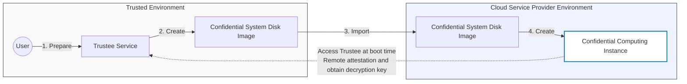

# cryptpilot-fde: Full Disk Encryption for Confidential Computing

[](https://opensource.org/licenses/Apache-2.0)

`cryptpilot-fde` provides Full Disk Encryption (FDE) capabilities for confidential computing environments. It encrypts the entire system disk, protects boot integrity, and enables secure boot with remote attestation.

The usage workflow is shown below:



## Features

- **Full Disk Encryption**: Encrypts both rootfs and data partitions
- **Integrity Protection**: Uses dm-verity to protect read-only rootfs
- **Measurement & Attestation**: Measures boot artifacts for remote attestation
- **Flexible Key Management**: Supports KBS, KMS, OIDC, TPM2, and custom exec providers
- **Overlay Filesystem**: Provides writable overlay on read-only encrypted rootfs

## Installation

Install from the [latest release](https://github.com/openanolis/cryptpilot/releases):

```sh
# Install cryptpilot-fde package
rpm --install cryptpilot-fde-*.rpm
```

Or build from source (see [Development Guide](../docs/development.md)).

## Quick Start

Encrypt a bootable disk image:

```sh
cryptpilot-convert --in ./original.qcow2 --out ./encrypted.qcow2 \
    -c ./config_dir/ --rootfs-passphrase MyPassword
```

📖 [Detailed Quick Start Guide](docs/quick-start.md)

## Configuration

Configuration files are located in `/etc/cryptpilot/`:

- **`fde.toml`**: FDE configuration (rootfs and data volumes)
- **`global.toml`**: Global settings (optional)

See [Configuration Guide](docs/configuration.md) for detailed options.

### Configuration Templates

- [fde.toml.template](../dist/etc/fde.toml.template)
- [global.toml.template](../dist/etc/global.toml.template)

## Commands

### `cryptpilot-fde show-reference-value`

Display cryptographic reference values for attestation:

```sh
cryptpilot-fde show-reference-value --stage system --disk /path/to/disk.qcow2
```

### `cryptpilot-fde config check`

Validate FDE configuration:

```sh
cryptpilot-fde config check --keep-checking
```

### `cryptpilot-fde config dump`

Export configuration as TOML for cloud-init:

```sh
cryptpilot-fde config dump --disk /dev/sda
```

### `cryptpilot-fde boot-service`

Internal commands used by systemd during boot (do not call manually):

```sh
cryptpilot-fde boot-service --stage before-sysroot
cryptpilot-fde boot-service --stage after-sysroot
```

## Helper Scripts

### cryptpilot-convert

Convert and encrypt existing disk images or system disks:

```sh
cryptpilot-convert --help
```

### cryptpilot-enhance

Harden VM disk images before encryption (removes cloud agents, protects SSH):

```sh
cryptpilot-enhance --mode full --image ./disk.qcow2
```

See [cryptpilot-enhance documentation](docs/cryptpilot_enhance.md) for details.

## Documentation

- [Quick Start Guide](docs/quick-start.md) - Step-by-step examples
- [Configuration Guide](docs/configuration.md) - Detailed configuration options
- [Boot Process](docs/boot.md) - How cryptpilot-fde integrates with system boot
- [Development Guide](../docs/development.md) - Build and test instructions

## How It Works

`cryptpilot-fde` runs in the initrd and operates in two stages:

1. **Before Sysroot Mount** (`before-sysroot` stage):
   - Decrypts rootfs (if encrypted)
   - Sets up dm-verity integrity protection
   - Measures boot artifacts and generates attestation evidence
   - Decrypts and mounts data partition

2. **After Sysroot Mount** (`after-sysroot` stage):
   - Sets up writable overlay on read-only rootfs
   - Overlay stored on encrypted data partition or tmpfs
   - Prepares system for switch_root

See [Boot Process Documentation](docs/boot.md) for details.

## Key Providers

Multiple key providers are supported for flexible key management:

- **KBS**: Key Broker Service with remote attestation
- **KMS**: Alibaba Cloud Key Management Service
- **OIDC**: KMS using OpenID Connect authentication
- **Exec**: Custom executable that provides the key

See [Key Providers](../docs/key-providers.md) for detailed configuration.

## Supported Distributions

- [Anolis OS 23](https://openanolis.cn/anolisos/23)
- [Alibaba Cloud Linux 3](https://www.aliyun.com/product/alinux)

## License

Apache-2.0

## See Also

- [cryptpilot-crypt](../cryptpilot-crypt/) - Runtime volume encryption
- [cryptpilot-verity](../cryptpilot-verity/) - dm-verity tools
- [Main Project README](../README.md)
