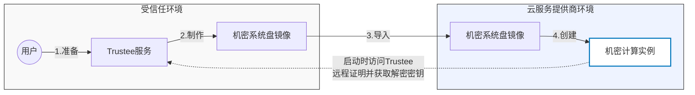

# cryptpilot-fde：面向机密计算的全盘加密

[](https://opensource.org/licenses/Apache-2.0)

`cryptpilot-fde` 为机密计算环境提供全盘加密（FDE）能力。它加密整个系统磁盘、保护启动完整性，并支持远程证明的安全启动。

其使用方式如下图所示



## 功能特性

- **全盘加密**：同时加密 rootfs 和数据分区
- **完整性保护**：使用 dm-verity 保护只读 rootfs
- **度量与证明**：度量启动工件用于远程证明
- **灵活的密钥管理**：支持 KBS、KMS、OIDC、TPM2 和自定义 exec 提供者
- **差异层机制**：在只读加密 rootfs 上提供可写差异层（支持 overlayfs 或 dm-snapshot）

## 安装

从[最新发布版本](https://github.com/openanolis/cryptpilot/releases)安装：

```sh
# 安装 cryptpilot-fde 包
rpm --install cryptpilot-fde-*.rpm
```

或从源码构建（参见[开发指南](../docs/development.md)）。

## 快速开始

加密可启动磁盘镜像：

```sh
cryptpilot-convert --in ./original.qcow2 --out ./encrypted.qcow2 \
    -c ./config_dir/ --rootfs-passphrase MyPassword
```

📖 [详细快速开始指南](docs/quick-start_zh.md)

## 配置

配置文件位于 `/etc/cryptpilot/`：

- **`fde.toml`**：FDE 配置（rootfs 和数据卷）
- **`global.toml`**：全局设置（可选）

详细选项请参阅[配置指南](docs/configuration_zh.md)。

### 配置示例模板

- [fde.toml.template](../dist/etc/fde.toml.template)
- [global.toml.template](../dist/etc/global.toml.template)

## 命令

### `cryptpilot-fde show-reference-value`

显示用于证明的加密参考值：

```sh
cryptpilot-fde show-reference-value --disk /path/to/disk.qcow2
```

### `cryptpilot-fde config check`

验证 FDE 配置：

```sh
cryptpilot-fde config check --keep-checking
```

### `cryptpilot-fde config dump`

导出配置为 TOML 格式用于 cloud-init：

```sh
cryptpilot-fde config dump --disk /dev/sda
```

### `cryptpilot-fde boot-service`

由 systemd 在启动期间使用的内部命令（请勿手动调用）：

```sh
cryptpilot-fde boot-service --stage before-sysroot
cryptpilot-fde boot-service --stage after-sysroot
```

## 辅助脚本

### cryptpilot-convert

转换并加密现有磁盘镜像或系统磁盘：

```sh
cryptpilot-convert --help
```

### cryptpilot-enhance

在加密前加固虚拟机磁盘镜像（删除云代理、保护 SSH）：

```sh
cryptpilot-enhance --mode full --image ./disk.qcow2
```

详情请参阅 [cryptpilot-enhance 文档](docs/cryptpilot_enhance_zh.md)。

## 文档

- [快速开始指南](docs/quick-start_zh.md) - 分步示例
- [配置指南](docs/configuration_zh.md) - 详细配置选项
- [启动过程](docs/boot_zh.md) - cryptpilot-fde 如何与系统启动集成
- [开发指南](../docs/development.md) - 构建和测试说明

## 工作原理

`cryptpilot-fde` 在 initrd 中运行，分为两个阶段：

1. **Sysroot 挂载前**（`before-sysroot` 阶段）：
   - 解密 rootfs（如果已加密）
   - 设置 dm-verity 完整性保护
   - 度量启动工件并生成证明证据
   - 解密并挂载数据分区

2. **Sysroot 挂载后**（`after-sysroot` 阶段）：
   - 在只读 rootfs 上设置可写差异层
   - 差异层存储在加密 delta 分区或内存中
   - 为 switch_root 准备系统

详情请参阅[启动过程文档](docs/boot_zh.md)。

## 密钥提供者

支持多种密钥提供者以实现灵活的密钥管理：

- **KBS**：带远程证明的密钥代理服务
- **KMS**：阿里云密钥管理服务
- **OIDC**：使用 OpenID Connect 认证的 KMS
- **Exec**：提供密钥的自定义可执行文件

详细配置请参阅[密钥提供者](../docs/key-providers_zh.md)。

## 支持的发行版

- [Anolis OS 23](https://openanolis.cn/anolisos/23)
- [Alibaba Cloud Linux 3](https://www.aliyun.com/product/alinux)

## 许可证

Apache-2.0

## 参见

- [cryptpilot-crypt](../cryptpilot-crypt/) - 运行时卷加密
- [cryptpilot-verity](../cryptpilot-verity/) - dm-verity 工具
- [主项目 README](../README_zh.md)
