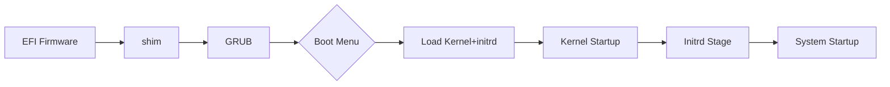

# CryptPilot System Disk Encryption Boot Architecture

This document describes the boot process and implementation principles of the CryptPilot system disk encryption solution, covering the complete chain from image preparation to system startup.

## 1. Overview

The CryptPilot system disk encryption solution provides boot-time integrity protection and runtime data encryption for Linux systems. It uses dm-verity technology to protect root filesystem integrity, LUKS2 for data encryption, and overlayfs to build a writable runtime environment.

### 1.1 Technical Principles

The CryptPilot system disk encryption solution is implemented through Linux kernel dm-verity and LUKS2 technologies, providing both measurability and data encryption capabilities for confidential system disks.

- **Measurability**: Based on the dm-verity mechanism, the system builds a complete hash tree structure for the rootfs volume during boot, ensuring filesystem integrity through layer-by-layer verification. This mechanism combines with memory encryption technology to store the root hash value of the root filesystem in secure memory. During system startup, the kernel verifies whether the hash value of each data block in the rootfs volume matches the pre-stored root hash value. Any unauthorized modifications are detected in real-time and prevent system boot, thereby ensuring trusted measurement and tamper-proof protection for the root filesystem.

- **Data Encryption**: Through the LUKS2 standard, using AES-256 algorithm for full disk encryption. The encryption process adopts a hierarchical key system: the user-managed Master Key is used to encrypt data, while the Master Key itself is protected by another Key Encryption Key (KEK). The KEK is delivered through the remote attestation mechanism after the instance is verified. All data is automatically encrypted before being written to disk, and decrypted in the secure memory of the confidential instance when read, ensuring that encrypted data remains encrypted during cloud disk storage and meeting the requirements for autonomous control throughout the key lifecycle.

### 1.2 Volume Structure

In CryptPilot, data is encrypted in units of volumes. The confidential system disk contains two key volumes:

```txt
                                                            +-------------------------------------------+
                                                            |           Combined Root Filesystem        |
                                                            +----------------------+--------------------+
                                                            |                      |                    |
                                                            |   Root Filesystem    |   Difference Data  |
                                                            |   (Read-only Part)   |                    |
                                                            |                      |                    |
                                                            +----------------------+--------------------+
                                                            |                      |                    |
                                                            |  Read-only rootfs    |  Read-write data   |
                                                            |  (Measured, Optional |  (Encrypted,       |
                                                            |   Encryption)        |   Integrity)       |
                                                            |                      |                    |
                                                            +----------------------+--------------------+
+--------------+                                            | +--------+  +--------+                    |
|   Trustee    | <---- 1. Remote Attestation Carries ---->  | | Kernel |  | initrd |    System Disk     |
| Trust Mgmt   |          Root Filesystem Measurement       | +--------+  +----^---+                    |
+--------------+                                            +------------------+------------------------+
        |                                                                      |
        +----------------------------------------------------------------------+ 2. Obtain Volume Decryption Key
```

- **rootfs Volume**: The rootfs volume stores the read-only root filesystem.

    - Measurement: During boot, the content of this volume is measured, and a hash tree is built for the rootfs volume based on the kernel's dm-verity mechanism. Since the measurement value is stored in memory, data modification is prevented. To maintain compatibility with business applications in the system, a writable overlay layer is overlaid on the read-only root filesystem during the startup phase, allowing temporary write modifications to the root filesystem. These write modifications will not destroy the read-only layer nor affect the measurement of the read-only root filesystem.

    - Encryption: Encryption of this volume is optional, depending on your business requirements. If you need to encrypt the rootfs volume data, you can configure encryption options during the confidential system disk creation process.

- **data Volume**: The data volume is an encrypted volume composed of the remaining available space on the system disk, containing a read-write Ext4 filesystem.

    - Encryption: During system startup, this volume is decrypted, and after entering the system, it is mounted to the `/data` location. Any data written to the data volume is encrypted before being written to disk. Users can write their data files here, and the data will not be lost after instance restart.

### 1.3 Core Components

The core components of the system disk encryption solution include:
- **cryptpilot-convert**: Prepares encrypted disk layout during the image conversion phase
- **cryptpilot-fde**: Performs decryption and mounting operations during system boot

The entire process is divided into the image preparation phase and the system startup phase. The image preparation phase completes disk layout conversion in an offline environment, while the system startup phase completes device activation and filesystem mounting on each boot.

## 2. Image Preparation Phase

The image preparation phase is executed by `cryptpilot-convert` in an offline environment, responsible for converting ordinary disk images into layouts that support system disk encryption. The core tasks of this phase are to prepare data structures for dm-verity integrity protection and plan metadata required for startup.

The conversion process first shrinks the original rootfs partition to its minimum size to reduce the storage overhead of the hash tree. Then the dm-verity hash tree is calculated, outputting hash tree data and root_hash values. The hash tree data is stored in a separate logical volume, while root_hash is recorded in the `metadata.toml` file.

The converted disk uses LVM to manage storage layout, creating three logical volumes in a volume group named "system": the rootfs logical volume stores the shrunk rootfs data, the rootfs_hash logical volume stores the dm-verity hash tree, and the data logical volume serves as reserved space for the data volume, used for storing writable layers and user data after startup.

The `metadata.toml` file contains metadata format version and dm-verity root_hash values. This file is embedded into the initrd image during the conversion process and can be accessed in the initrd environment during startup.

## 3. Boot Modes and Boot Configuration

The system disk encryption solution supports two boot modes, selected through the `--uki` parameter of `cryptpilot-convert`.

### 3.1 GRUB Mode (Default)

GRUB mode uses GRUB2 as the bootloader, suitable for scenarios requiring multi-kernel version management and boot menus.

**Partition Layout**:

| Partition | Mount Point | Purpose |
|-----------|-------------|---------|
| EFI System Partition | `/boot/efi` | Stores shim, GRUB bootloader |
| Boot Partition | `/boot` | Stores kernel, initrd, grub.cfg |
| LVM Physical Volume | - | Contains rootfs, rootfs_hash, data logical volumes |

**Boot Flow**:



GRUB mode supports multi-kernel version management, allowing users to select different kernel versions through the menu during boot. `cryptpilot-fde` parses saved_entry in grubenv when calculating reference values, reading the corresponding kernel version for measurement.

### 3.2 UKI Mode (`--uki`)

UKI mode uses Unified Kernel Image, packaging the kernel, initrd, and kernel command line into a single EFI executable file.

**Partition Layout**:

| Partition | Mount Point | Purpose |
|-----------|-------------|---------|
| EFI System Partition | `/boot/efi` | Stores UKI image (BOOTX64.EFI) |
| LVM Physical Volume | - | Contains rootfs, rootfs_hash, data logical volumes |

UKI mode does not require an independent boot partition, resulting in a more concise partition layout.

**Boot Flow**:


UKI generation uses dracut's `--uefi` parameter. The default kernel command line is `console=tty0 console=ttyS0,115200n8`, and custom parameters can be appended via `--uki-append-cmdline`. `cryptpilot-fde` parses segments in the UKI image directly when calculating reference values.

### 3.3 Mode Comparison

| Feature | GRUB Mode | UKI Mode |
|---------|-----------|----------|
| Partition Count | 3 (EFI, boot, LVM) | 2 (EFI, LVM) |
| Boot Files | Multiple (shim, GRUB, kernel, initrd) | Single UKI file |
| Multi-kernel Support | Yes | No |
| Boot Menu | Yes | No |
| Command Line Customization | Through grub.cfg | Through `--uki-append-cmdline` |

Both modes have identical processing flows after the Initrd stage, with differences mainly in partition layout and boot file generation during the image conversion phase.

## 4. Initrd Stage

The Initrd stage is the core execution phase of the system disk encryption solution, with device activation and filesystem mounting orchestrated by systemd services. This stage operates through two services working together: `cryptpilot-fde-before-sysroot` prepares block devices, and `cryptpilot-fde-after-sysroot` builds the writable runtime environment.

### 4.1 Pre-boot Preparation (cryptpilot-fde-before-sysroot)

This service executes before `initrd-root-device.target` and is the key stage for device preparation. The service first activates the LVM volume group, making all logical volumes visible. Then it reads root_hash from `metadata.toml`, which serves as the integrity verification basis for dm-verity device activation.

The construction of the rootfs device chain varies depending on encryption configuration. If rootfs encryption is configured, the service first obtains the passphrase through a key provider and opens the LUKS2 encrypted volume, then establishes dm-verity on the decrypted device. If encryption is not configured, dm-verity is established directly on the rootfs logical volume.

Data volume initialization is completed in the same stage. The service checks whether the data logical volume exists, creating it if it does not and occupying all remaining space in the volume group. If the data volume already exists, it is expanded to the remaining space in the volume group. Then the passphrase for the data volume is obtained, determining whether reinitialization is needed, formatting LUKS2 and creating the filesystem.

Additionally, the service checks whether the disk where the LVM physical volume resides has unallocated space, and if so, extends the partition and expands the physical volume. This mechanism enables the system to automatically adapt to disk expansion scenarios in cloud environments.

### 4.2 dracut Mounts Sysroot

After `cryptpilot-fde-before-sysroot` completes, dracut takes over execution. dracut identifies the dm-verity device as the root device and mounts it to `/sysroot`. Due to the nature of dm-verity, this mount is read-only. At this point, `/sysroot` presents the original rootfs content protected by integrity verification.

### 4.3 Overlay Layer Establishment (cryptpilot-fde-after-sysroot)

This service executes after `sysroot.mount`, resolving the conflict between dm-verity read-only restrictions and system runtime write requirements. The service first backs up the read-only `/sysroot`, preserving access paths to the original dm-verity device as the lowerdir for overlayfs.

Writable layer preparation is performed according to the `rw_overlay` configuration. When configured as `ram`, tmpfs in memory is used as upperdir, with data lost after reboot. When configured as `disk` or `disk-persist`, the overlay directory in the data volume is used as upperdir, with `disk` mode clearing on each boot while `disk-persist` mode retains data.

Overlayfs mounting combines lowerdir, upperdir, and workdir, mounting the unified view to `/sysroot` to override the original read-only mount. After mounting, read operations are passed through to the dm-verity protected lowerdir, while write operations are redirected to the writable upperdir, providing users with persistent data storage space.

For container runtime scenarios, the following directories are bind mounted to independent subdirectories within the writable layer, with original content copied from lowerdir on first boot:
- `/var/lib/containerd/io.containerd.snapshotter.v1.overlayfs/snapshots/`
- `/var/lib/containers/`
- `/var/lib/docker/`

Failure to bind mount these directories will not prevent system startup, only error logs are recorded.

## 5. System Switch Stage

After `cryptpilot-fde-after-sysroot` completes, the initrd stage ends. dracut performs cleanup work and hands over control to systemd. systemd switches `/sysroot` as the real root filesystem, and the system enters the normal System Manager stage. At this point, the running root filesystem is the overlayfs unified view, protected by dm-verity integrity while supporting normal write operations.
