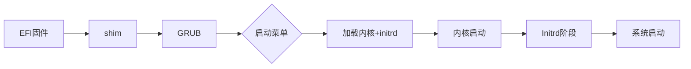

# CryptPilot系统盘加密启动架构

本文档详细阐述CryptPilot系统盘加密方案的启动流程与实现原理，涵盖从镜像准备到系统启动的完整链路。

## 1. 概述

CryptPilot系统盘加密方案旨在为Linux系统提供启动时完整性保护和运行时数据加密能力。该方案通过dm-verity技术保护根文件系统完整性，结合LUKS2实现数据加密，并通过overlayfs构建可写的运行时环境。

### 1.1 技术原理

CryptPilot系统盘加密方案通过Linux内核的dm-verity和LUKS2技术实现，能够为机密实例的系统盘提供可度量和数据加密两种能力。

- **可度量**：基于dm-verity机制，系统在启动时将对rootfs卷构建完整的哈希树结构，通过逐层校验确保文件系统的完整性。该机制将与内存加密技术相结合，将根文件系统的根哈希值存储在安全的内存中。在系统启动过程中，内核将验证rootfs卷每个数据块的哈希值是否与预存的根哈希值一致，任何未经授权的修改都会被实时检测并阻止系统启动，从而实现对根文件系统的可信度量及防篡改保障。

- **数据加密**：通过LUKS2标准，采用AES-256算法实现全盘加密。加密过程采用分层密钥体系：用户自主管理的主密钥（Master Key）用于加密数据，而主密钥本身则由另一个密钥加密密钥（KEK）进行保护。KEK通过远程证明机制在对实例进行验证后下发。所有数据在写入磁盘之前会自动进行加密，而在读取时则在机密实例的安全内存中进行解密，从而确保加密数据在云盘存储期间始终处于加密状态，并满足密钥全生命周期的自主可控需求。

### 1.2 卷结构

在CryptPilot中，数据是以卷（Volume）为单元进行加密，机密系统盘中包含两个关键卷：

```txt
                                        +-------------------------------------------+
                                        |              组合后的根文件系统              |
                                        +----------------------+--------------------+
                                        |                      |                    |
                                        |      根文件系统        |       差异数据      |
                                        |      (只读部分)       |                    |
                                        |                      |                    |
                                        +----------------------+--------------------+
                                        |                      |                    |
                                        |     只读rootfs卷      |     可读写data卷    |
                                        | (被度量、可选加密保护)  |    (加密、完整性保护) |
                                        |                      |                    |
                                        +----------------------+--------------------+
+--------------+                        | +--------+  +--------+                    |
|    Trustee   | <-- 1. 远程证明携带 ---> | | Kernel |  | initrd |       系统盘        |
|  信任管理服务  |    根文件系统度量值       | +--------+  +----^---+                    |
+--------------+                        +------------------+------------------------+
        |                                                  |
        +--------------------------------------------------+ 2. 获取卷解密密钥
```

- **rootfs卷**：rootfs卷存放了只读的根文件系统。

    - 度量：在启动时该卷的内容会被度量，并基于内核的dm-verity机制对rootfs卷建立哈希树。由于度量值被存储在内存中，可以防止数据被修改。为了保持系统中业务程序的兼容性，在启动阶段，一个可写入的覆盖层将被覆盖在只读的根文件系统上，从而允许您在根文件系统上做临时性的写入修改。这些写入修改将不会破坏只读层，也不会影响只读根文件系统的度量。

    - 加密：对该卷的加密是一个可选的操作，这取决于您的业务需求。如果您需要加密rootfs卷的数据，可以在创建机密系统盘的过程中配置加密选项。

- **data卷**：data卷是系统盘上剩余可用空间组成的一个加密卷，包含一个可读写的Ext4文件系统。

    - 加密：在系统启动过程中，该卷会被解密，并且在进入系统后，该卷会被挂载到/data位置上。任何data卷上写入的数据，都会被加密后落盘。用户可以将其数据文件写入到此处，在实例重新启动后，数据不会丢失。


### 1.3 核心组件

系统盘加密方案的核心组件包括：
- **cryptpilot-convert**：在镜像转换阶段准备加密磁盘布局
- **cryptpilot-fde**：在系统启动时执行解密和挂载操作

整个流程分为镜像准备阶段和系统启动阶段。镜像准备阶段在离线环境中完成磁盘布局转换，系统启动阶段在每次开机时完成设备激活和文件系统挂载。

## 2. 镜像准备阶段

镜像准备阶段由`cryptpilot-convert`在离线环境中执行，负责将普通磁盘镜像转换为支持系统盘加密的布局。该阶段的核心任务是为dm-verity完整性保护准备数据结构，并规划启动时所需的元数据。

转换过程首先对原始rootfs分区进行收缩，压缩至最小尺寸以减少哈希树的存储开销。随后计算dm-verity哈希树，输出包括哈希树数据和root_hash值。哈希树数据被存储到独立的逻辑卷，而root_hash则记录到`metadata.toml`文件中。

转换后的磁盘采用LVM管理存储布局，在名为system的卷组中创建三个逻辑卷：rootfs逻辑卷存储收缩后的rootfs数据，rootfs_hash逻辑卷存储dm-verity哈希树，data逻辑卷作为数据卷预留空间，用于启动后存储可写层和用户数据。

`metadata.toml`文件包含元数据格式版本和dm-verity的root_hash值，该文件在转换过程中被嵌入initrd镜像，启动时可在initrd环境中访问。

## 3. 启动模式与引导配置

系统盘加密方案支持两种启动模式，通过`cryptpilot-convert`的`--uki`参数选择。

### 3.1 GRUB模式（默认）

GRUB模式使用GRUB2作为引导加载程序，适用于需要多内核版本管理和启动菜单的场景。

**分区布局**：

| 分区 | 挂载点 | 用途 |
|------|--------|------|
| EFI系统分区 | `/boot/efi` | 存储shim、GRUB引导程序 |
| boot分区 | `/boot` | 存储内核、initrd、grub.cfg |
| LVM物理卷 | - | 包含rootfs、rootfs_hash、data逻辑卷 |

**引导流程**：



GRUB模式支持多内核版本管理，用户可在启动时通过菜单选择不同内核版本。`cryptpilot-fde`在计算参考值时解析grubenv中的saved_entry，读取对应内核版本进行度量。

### 3.2 UKI模式（`--uki`）

UKI模式使用统一内核镜像（Unified Kernel Image），将内核、initrd、内核命令行打包为单个EFI可执行文件。

**分区布局**：

| 分区 | 挂载点 | 用途 |
|------|--------|------|
| EFI系统分区 | `/boot/efi` | 存储UKI镜像(BOOTX64.EFI) |
| LVM物理卷 | - | 包含rootfs、rootfs_hash、data逻辑卷 |

UKI模式无需独立的boot分区，分区布局更简洁。

**引导流程**：


UKI生成使用dracut的`--uefi`参数，默认内核命令行为`console=tty0 console=ttyS0,115200n8`，可通过`--uki-append-cmdline`追加自定义参数。`cryptpilot-fde`在计算参考值时直接解析UKI镜像中的各段进行度量。

### 3.3 模式对比

| 特性 | GRUB模式 | UKI模式 |
|------|---------|---------|
| 分区数量 | 3个（EFI、boot、LVM） | 2个（EFI、LVM） |
| 引导文件 | 多个（shim、GRUB、内核、initrd） | 单个UKI文件 |
| 多内核支持 | 是 | 否 |
| 启动菜单 | 有 | 无 |
| 命令行定制 | 通过grub.cfg | 通过`--uki-append-cmdline` |

两种模式在Initrd阶段之后的处理流程完全相同，差异主要体现在镜像转换阶段的分区布局和引导文件生成方式。

## 4. Initrd阶段

Initrd阶段是系统盘加密方案的核心执行阶段，由systemd服务编排完成设备激活和文件系统挂载。该阶段通过两个服务协同工作：`cryptpilot-fde-before-sysroot`负责准备块设备，`cryptpilot-fde-after-sysroot`负责构建可写的运行时环境。

### 3.1 启动前准备（cryptpilot-fde-before-sysroot）

该服务在`initrd-root-device.target`之前执行，是设备准备的关键阶段。服务首先激活LVM卷组，使所有逻辑卷可见。随后从`metadata.toml`读取root_hash，该值是dm-verity设备激活时的完整性校验依据。

rootfs设备链的构建根据加密配置有所不同。若配置了rootfs加密，服务首先通过密钥提供者获取passphrase并打开LUKS2加密卷，再在该解密设备上建立dm-verity。若未配置加密，则直接在rootfs逻辑卷上建立dm-verity。

data卷的初始化在同一阶段完成。服务检查data逻辑卷是否存在，若不存在则创建并占用卷组全部剩余空间。若data卷已存在，则将其扩容至卷组剩余空间。随后获取data卷的passphrase，判断是否需要重新初始化，格式化LUKS2并创建文件系统。

此外，服务还会检查LVM物理卷所在磁盘是否有未分配空间，若有则扩展分区并扩容物理卷。这一机制使系统能够自动适应云环境中磁盘扩容的场景。

### 3.2 dracut挂载sysroot

`cryptpilot-fde-before-sysroot`完成后，dracut接管执行。dracut识别dm-verity设备为root设备，将其挂载到`/sysroot`。由于dm-verity的特性，此挂载为只读。此时`/sysroot`呈现的是受完整性保护的原始rootfs内容。

### 3.3 差异层建立（cryptpilot-fde-after-sysroot）

该服务在`sysroot.mount`之后执行，解决dm-verity只读限制与系统运行时写入需求的矛盾。服务首先备份只读的`/sysroot`，保留原始dm-verity设备的访问路径作为overlayfs的lowerdir。

可写层的准备根据配置`rw_overlay`进行。配置为`ram`时使用内存中的tmpfs作为upperdir，数据在重启后丢失。配置为`disk`或`disk-persist`时使用data卷中的overlay目录作为upperdir，`disk`模式在每次启动时清空而`disk-persist`模式保留数据。

overlayfs挂载将lowerdir、upperdir和workdir组合，将联合视图挂载到`/sysroot`覆盖原有的只读挂载。挂载后读取操作透传到dm-verity保护的lowerdir，写入操作重定向到可写的upperdir。

对于容器运行时等场景，以下目录会被bind mount到可写层内的独立子目录，首次启动时从lowerdir复制原始内容：
- `/var/lib/containerd/io.containerd.snapshotter.v1.overlayfs/snapshots/`
- `/var/lib/containers/`
- `/var/lib/docker/`

这些目录的bind mount失败不会阻止系统启动，仅记录错误日志。最后将data卷内的data目录暴露到`/sysroot/data`，为用户提供持久化数据存储空间。

## 5. 系统切换阶段

`cryptpilot-fde-after-sysroot`完成后，initrd阶段结束。dracut执行清理工作，将控制权交给systemd。systemd将`/sysroot`作为真实根文件系统切换，系统进入正常的System Manager阶段，此时运行的根文件系统是overlayfs联合视图，既受dm-verity完整性保护又支持正常写入操作。


